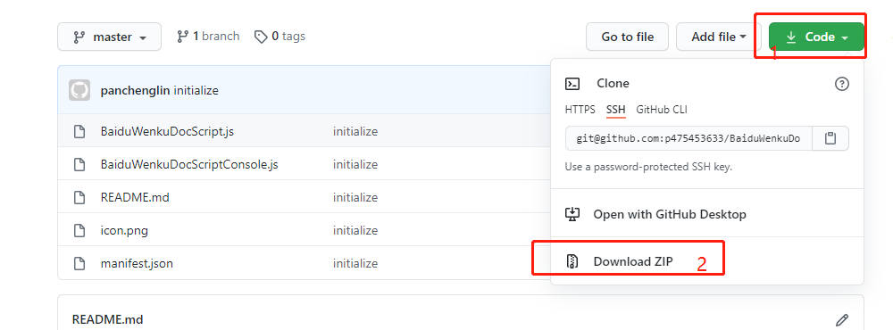

# 获取百度文库文本的方法执行步骤
* 使用软件：Chrome

* 注意：

    * 使用方式1同时也解除了百度文库的ctrl+c限制。

* 可选方式1：
    * 安装Chrome的JS插件：参考https://my.oschina.net/hetiangui/blog/135744

    * 安装插件后重新刷新页面，F12打开Console面板即可看到文本内容。

    * 全过程如下：

      1. 下载代码

      

      2. 安装插件

    

    

    3. 刷新百度文库页面后，快捷键按F12或者右击chrome中空白位置打开"检查"，选择console面板即可。

* 可选方式2：

    ```js
    // 方式2： Chrome Console面板直接执行JS代码
    // 1.打开Chrome，进入到需要获取文本的页面（注意：如果有未完继续页需要先全部打开）
    // 2.快捷键按F12或者右击chrome中空白位置打开"检查"
    // 3.选择console面板
    // 4.复制粘贴下面代码到console面板，然后回车enter即可获取所有文本
    (function getAllTextContent(){
        var textNodeList = document.querySelectorAll("div.ie-fix");
        var textList = [];
        textNodeList.forEach((node) => {textList.push(node.textContent)});
        var textAll = textList.join("\r");
        console.log(textAll);
    })()
    ```

    